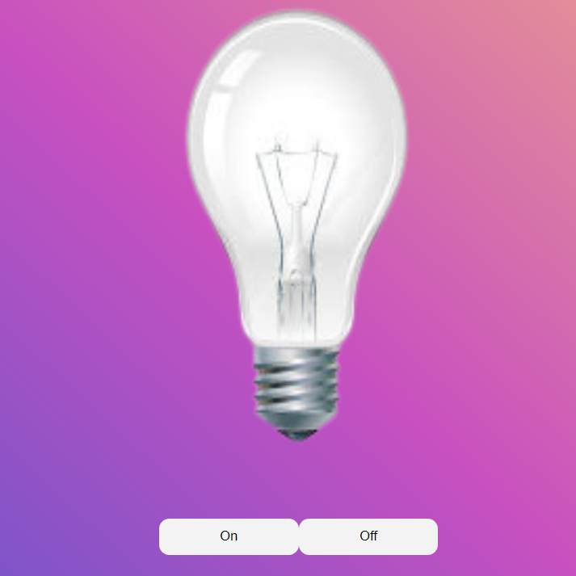

# LampadaJs
<h3>Lâmpada Javascript</h3>
Projeto realizado com base no conteúdo disponibilizado pelo 
<a href="https://github.com/fernandoleonid/mini-projetos-js">
Fernando Leonid - Mini Projetos Js</a>

